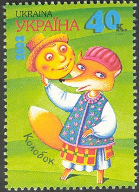


Žili kdysi v malé chaloupce, na kraji vsi, až u lesa, dedeček a babička. Jednou ráno dostal dědeček chuť na koblihy. A tak šel za babičkou a poprosil ji:
    “Babičko, prosím tě, usmaž mi dnes k snídani koblížek. Dostal jsem na něj velikou chuť.”
    A babička mu ho usmažila. Vzala trochu mouky, trochu smetánky, vajíčko a cukr, udělala těsto a na másle koblížek usmažila. Pak ho položila na okno, aby vychladl.
    Jenže koblížek byl neposeda. Chvíli kouká nalevo, chvíli napravo, támhle je louka a tam ves, tam je cesta, za ní les. A už se po té cestě kutálí pryč. Kutálí se kolem té louky, až do lesa. A potká zajíce:
    “Koblížku, koblížku, já tě sním!” A už se olizuje.
    “Nejez mě, zajíčku, zazpívám ti písničku.” Zajíc nastražil uši a koblížek se dal do zpěvu:

“Já jsem koblížek,
z mouky dělaný,
smetanou mísený,
na másle smažený,
na okně chlazený.
Dědovi jsem utekl,
babičce jsem utekl,
a tobě, zajíčku,
uteču taky!”

    A kutálel se, až se za ním prášilo. Než se zajíček vzpamatoval, byl už koblížek pryč.
    Kutálel se dál a potkal šedého vlka. Vlk byl stále hladový, jako každý správný vlk, a tak zastoupil koblížkovi cestu a povídá:
    “Koblížku, koblížku, já tě sním!” A cení zuby.
    “Nejez mě, vlku, zazpívám ti písničku.” Vlk zavřel tlamu a koblížek se dal do zpěvu:

“Já jsem koblížek,
z mouky dělaný,
smetanou mísený,
na másle smažený,
na okně chlazený.
Dědovi jsem utekl,
babičce jsem utekl,
zajíčkovi jsem utekl,
a tobě, vlku,
uteču taky!”

    Kutálel se dál a potkal medvěda huňáče. Medvěd rád sladké a tak se zálibně dívá na koblížka a povídá:
    “Koblížku, koblížku, já tě sním!” A už natahuje tlapy.
    “Nejez mě, medvěde, zazpívám ti písničku.” Medvěd se posadil a koblížek se dal do zpěvu:

“Já jsem koblížek,
z mouky dělaný,
smetanou mísený,
na másle smažený,
na okně chlazený.
Dědovi jsem utekl,
babičce jsem utekl,
zajíčkovi jsem utekl,
vlkovi jsem utekl,
a tobě, medvěde,
uteču taky!”

    Kutálel se dál a potkal lišku chytračku. A ta k němu hned běží:
    “Vítám tě, koblížku! Jak jsi hezoučký, kulaťoučký, červeňoučký!”
    A koblížek se začervenal ještě víc a byl rád, že ho liška pochválila, a hned spustil svoji písničku:

“Já jsem koblížek,
z mouky dělaný,
smetanou mísený,
na másle smažený,
na okně chlazený.
Dědovi jsem utekl,
babičce jsem utekl,
zajíčkovi jsem utekl,
vlkovi jsem utekl,
medvědovi jsem utekl,
a tobě, liško,
teprve uteču!”

    “To je ale krásná písnička,” povídá liška a naklonila se ke koblížkovi, “ale já už jsem moc stará a nějak špatně slyším. Vyskoč, posaď se mi na čumák, ať tě lépe slyším. A zazpívej ji ještě jednou a hlasitěji.”
    Koblížek byl ještě radši. Líbím se jí já a líbí se jí i má písnička. Vyhoupl se lišce na čumák a zazpíval:

“Já jsem koblížek,
z mouky…”

    A liška udělala HAM! a snědla ho. Z toho plyne, milé děti, poučení toto:

Když si koupíte k snídani koblížek,
dejte si pozor na lišky.